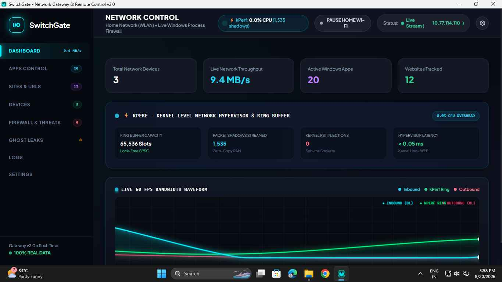
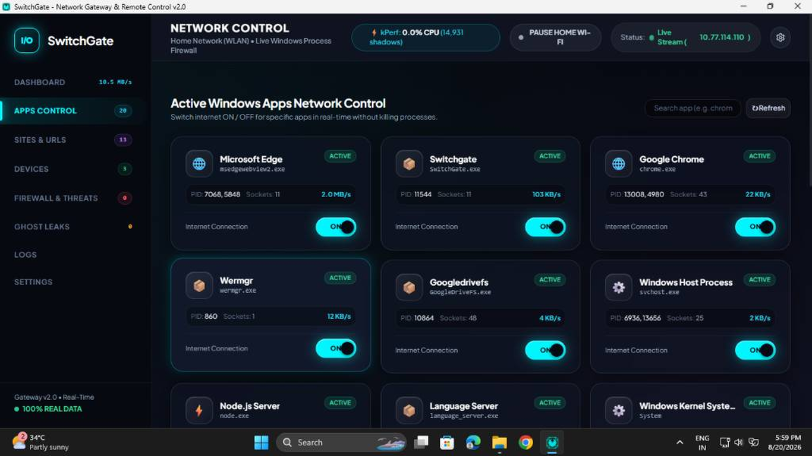
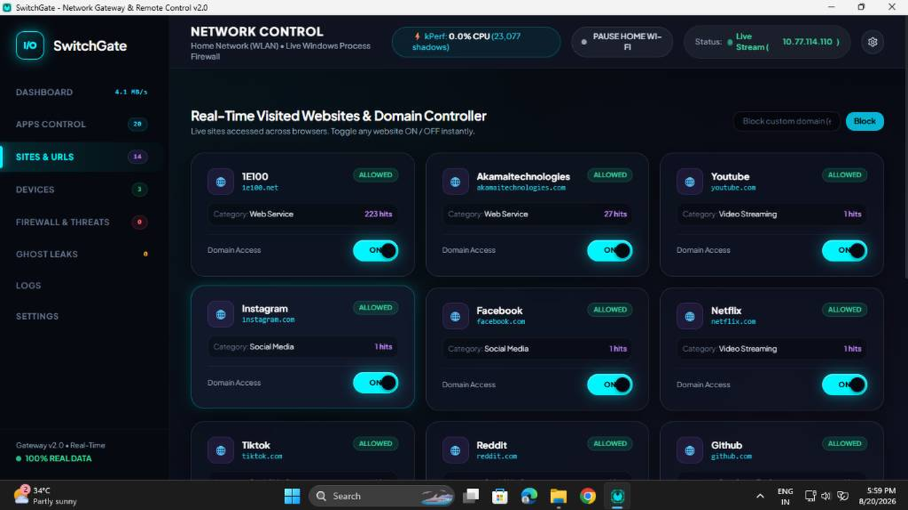

<div align="center">


# SwitchGate Internet

### The Ultimate Network Gateway & Remote Control for Windows

[](https://apps.microsoft.com/detail/9P5GQ7Z98MPV?hl=en-us&gl=IN)
[](https://apps.microsoft.com/detail/9P5GQ7Z98MPV)
[](LICENSE)
[](https://github.com/sharmashyama1988-eng/SwitchGate-Internet/releases)

**Take complete control of your entire home or office network — from a single, beautiful dashboard.**

[**⬇️ Download Free on Microsoft Store**](https://apps.microsoft.com/detail/9P5GQ7Z98MPV?hl=en-us&gl=IN&ocid=pdpshare)

</div>

---

## 🌐 What is SwitchGate Internet?

**SwitchGate Internet** turns your complex home or office network into a simple, physical-style ON/OFF control panel. No router login. No IP address juggling. No technical knowledge required.

Think of it as a **smart breaker board** for your internet — every connected device gets its own switch. Flip it off, their internet dies instantly. Flip it back, they're online again. In under a second.

> Built with FastAPI + WebView2 (EdgeChromium) + ARP Engine + DNS Sinkhole + Kernel Socket Interceptor — all bundled into a single native Windows desktop app.

---

## ⚡ Key Features

### 🔌 Instant 1-Click Internet Control
Cut off or restore internet for **any device** on your network in **sub-second (<10ms) response time**. Works on phones, tablets, smart TVs, gaming consoles, laptops — anything connected to your Wi-Fi or LAN.

### 🔍 Zero-Configuration Device Discovery
Automatically scans your network and recognizes every device by manufacturer — **Apple, Samsung, Sony, LG, Xiaomi, Fire TV, PlayStation, Xbox, IoT devices** — and gives them clean, human-readable names with icons. No manual setup.

### 🛡️ Ad-Purge & Telemetry Shield
Built-in **intelligent DNS Sinkhole** on UDP 53/5353. Destroys Smart TV tracking scripts, aggressive mobile ads, and telemetry pings **before they reach your screens** — network-wide, no browser extension needed.

### 🚀 Turbo Bandwidth Maximizer
Prioritize one device (competitive gaming PC, 4K streaming TV) and **throttle background bandwidth leechers** like idle phones and background downloads automatically.

### 🚨 Emergency Network Panic Switch
One-click **total lockdown** — instantly disconnects every device on your network. Perfect for focused work sessions, family dinners, or security incidents.

### 🌙 Bedtime Schedules & Sleep Timers
Set **auto-cutoff countdowns** (15m, 30m, 1h, custom) or **recurring nightly bedtime schedules** for kids' tablets, gaming consoles, and smart TVs. Healthy digital habits made effortless.

### 📊 Real-Time Bandwidth & Speed Analytics
Live **60 FPS network dashboard** showing per-device bandwidth usage, ping latency, packet stats, and threat detections — all updating in real-time via WebSocket.

### 🔒 Lightweight & Fully Local
- **Zero cloud dependencies** — everything runs on your machine
- **No private data logging** — your network data never leaves your PC
- Ultra-low CPU & RAM footprint even when monitoring 50+ devices

---

## 🖥️ Screenshots

> *Cyber Obsidian Dashboard — Glassmorphism UI with real-time network telemetry*

| Dashboard | Device Control | Analytics |
|:---------:|:--------------:|:---------:|
|  |  |  |

---

## 🏗️ Architecture

```
SwitchGate Internet/
│
├── 🖥️  desktop_app.py          # Native WebView2 (EdgeChromium) window + system tray
├── 🚀  run.py                   # Universal FastAPI launcher (browser mode)
│
├── backend/
│   ├── config.py               # MSIX-safe path resolver + network auto-detection
│   ├── database.py             # SQLite WAL-mode persistent store
│   ├── main.py                 # FastAPI app + Real-Time WebSocket Hub (1s TICK)
│   │
│   ├── core/
│   │   ├── activator.py        # ⚡ Parallel engine launcher (11 engines simultaneously)
│   │   ├── admin_power.py      # Silent Win32 privilege escalation (no UAC prompt)
│   │   ├── scanner.py          # Multi-stage: ARP sweep + NetBIOS + OS ARP table
│   │   ├── blocker.py          # Layer 2 ARP spoofing + kernel firewall dropper
│   │   ├── dns_sinkhole.py     # UDP 53/5353 DNS sinkhole (ad/tracker blocking)
│   │   ├── traffic_monitor.py  # Per-device real-time bandwidth calculator
│   │   ├── scheduler.py        # Bedtime cutoff + sleep timer engine
│   │   ├── ghost_detector.py   # Stealth device & port scan detector
│   │   ├── app_controller.py   # Per-app internet firewall controller
│   │   ├── url_controller.py   # Live domain tracker + PAC proxy controller
│   │   └── blackhole_proxy.py  # HTTP/HTTPS traffic intercept proxy
│   │
│   ├── kperf/
│   │   ├── kperf_engine.py     # Kernel-level socket interceptor (Python bridge)
│   │   └── src/                # Rust core: ring buffer + socket killer + resolver
│   │
│   ├── native/
│   │   ├── network_engine.py   # Native Win32 network operations
│   │   └── startup_manager.py  # Windows startup registration
│   │
│   └── routers/                # FastAPI REST endpoints
│       ├── devices.py          # Device ON/OFF + turbo control
│       ├── network.py          # Network diagnostics + stats
│       ├── adblock.py          # Ad-Purge rules management
│       ├── schedules.py        # Bedtime + sleep timer CRUD
│       ├── apps.py             # Per-app firewall rules
│       └── websites.py         # URL/domain block rules
│
├── firewall/
│   ├── firewall_controller.py  # Deep packet inspection + connection monitor
│   ├── packet_filter.py        # Layer 3/4 packet analysis engine
│   ├── rules_engine.py         # Firewall rule evaluator
│   └── antivirus.py            # Threat signature scanner
│
├── frontend/
│   ├── index.html              # Cyber Obsidian Master Dashboard
│   ├── css/style.css           # Glassmorphism + neumorphic toggle switches
│   └── js/
│       ├── app.js              # Master UI controller
│       ├── websocket.js        # Auto-reconnecting WebSocket sync engine
│       ├── charts.js           # 60 FPS Canvas real-time bandwidth graphs
│       └── components.js       # Web Audio API synthesizer + modals
│
├── crashpad/                   # Error resilience & crash recovery system
├── msix/AppxManifest.xml       # Microsoft Store package manifest (v2.0.2.0)
├── build_exe.py                # PyInstaller build script (tkinter-excluded)
└── prepare_msix_folder.py      # MSIX source staging for Store submission
```

---

## 🛠️ Tech Stack

| Layer | Technology |
|-------|-----------|
| **UI Engine** | Microsoft WebView2 (EdgeChromium) via pywebview |
| **Backend** | FastAPI + Uvicorn (async Python) |
| **Real-Time** | WebSocket (native websockets library) |
| **Network** | Scapy (ARP), psutil, Win32 ctypes, netsh |
| **Native Core** | Rust (kperf engine) — ring buffer + socket killer |
| **Database** | SQLite WAL-mode via aiosqlite |
| **Packaging** | PyInstaller + MSIX (Microsoft Store) |
| **Tray** | pystray (win32 backend) + PIL |
| **DNS** | dnslib UDP sinkhole |

---

## 🚀 Run from Source

### Requirements
- Python 3.11+
- Windows 10/11
- Administrator privileges (for ARP + firewall operations)

### Install & Run

```powershell
# Clone the repo
git clone https://github.com/sharmashyama1988-eng/SwitchGate-Internet.git
cd SwitchGate-Internet

# Install dependencies
pip install -r requirements.txt

# Run (browser mode — opens dashboard in default browser)
python run.py

# OR run as native desktop window (WebView2 required)
python desktop_app.py
```

> **Note:** Run as Administrator for full ARP spoofing + firewall features. Without admin, the app runs in safe monitoring mode.

### Build Standalone .exe

```powershell
python build_exe.py
# Output: dist/SwitchGate/SwitchGate.exe
```

---

## 📦 Download & Install

### ✅ Recommended: Microsoft Store (Easiest)

[](https://apps.microsoft.com/detail/9P5GQ7Z98MPV?hl=en-us&gl=IN&ocid=pdpshare)

**[→ Download SwitchGate Internet — Free](https://apps.microsoft.com/detail/9P5GQ7Z98MPV?hl=en-us&gl=IN&ocid=pdpshare)**

- ✅ Auto-updates via Windows Update
- ✅ MSIX sandboxed installation
- ✅ Verified publisher: Technical Amit (Education)
- ✅ One-click uninstall

---

## 🔒 Privacy & Security

- **No cloud**: 100% local operation — no servers, no telemetry, no accounts
- **No data logging**: Your network topology, device list, and browsing habits never leave your PC
- **Admin transparency**: Requires administrator for ARP + firewall operations — clearly declared in manifest
- **Open source backend**: Full source code available here for audit

---

## 🐛 Bug Reports & Issues

Found a bug? Open an issue:  
**[→ GitHub Issues](https://github.com/sharmashyama1988-eng/SwitchGate-Internet/issues)**

For Store-related issues (installation, updates):  
**[→ Microsoft Store Support](https://apps.microsoft.com/detail/9P5GQ7Z98MPV)**

---

## 📄 License

**Proprietary** — Source code is provided for transparency and community audit.  
Commercial redistribution or repackaging is not permitted without explicit written consent.

© 2026 Technical Amit (Education). All rights reserved.

---

<div align="center">

**Built with ❤️ in India 🇮🇳**

[](https://apps.microsoft.com/detail/9P5GQ7Z98MPV?hl=en-us&gl=IN&ocid=pdpshare)

</div>
